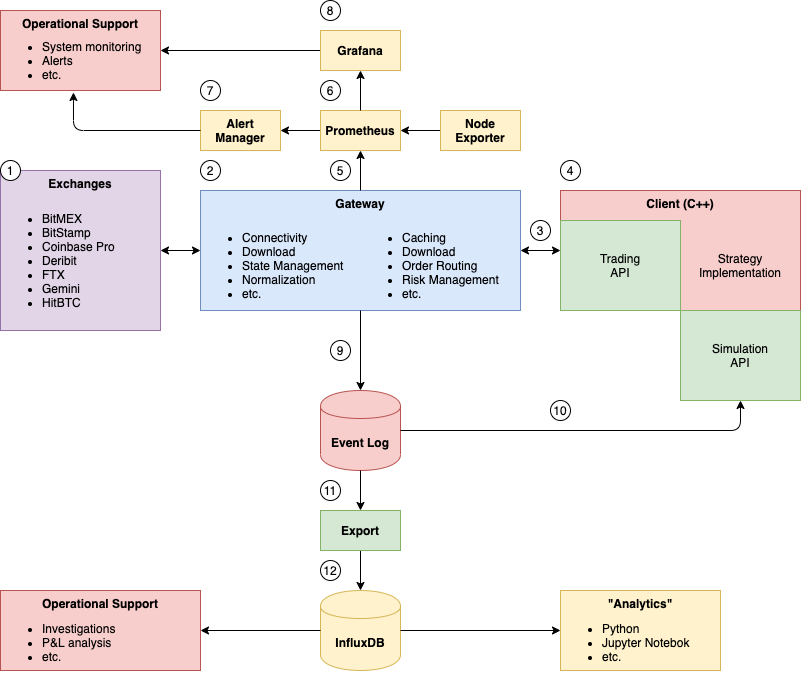
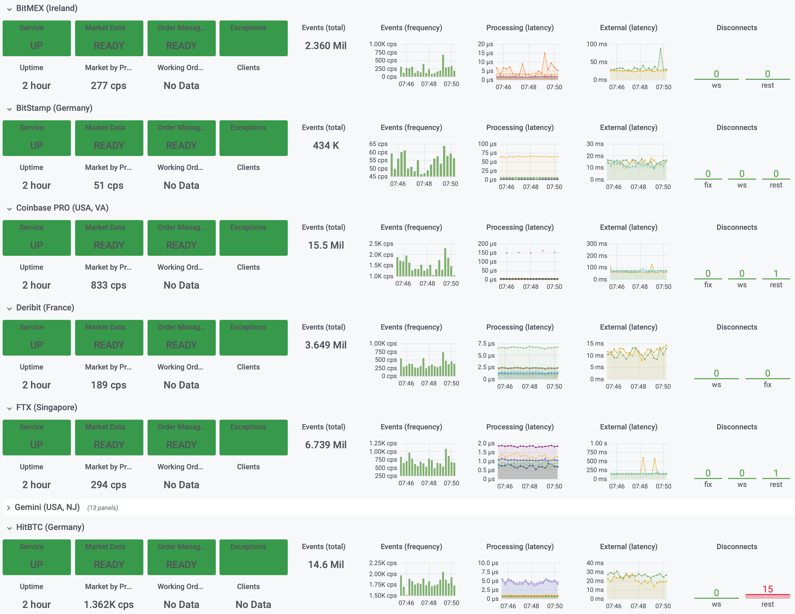
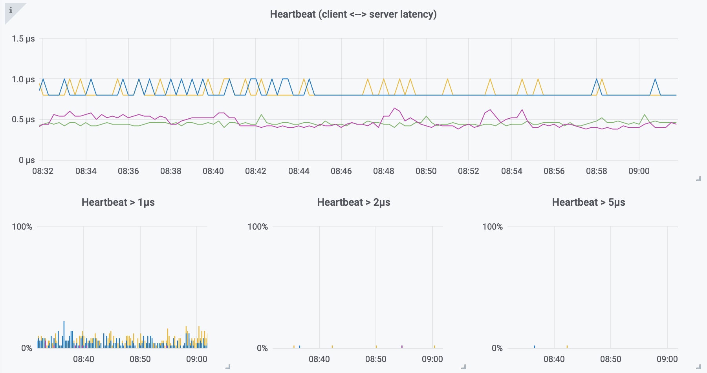
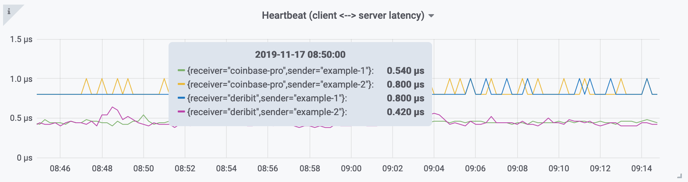
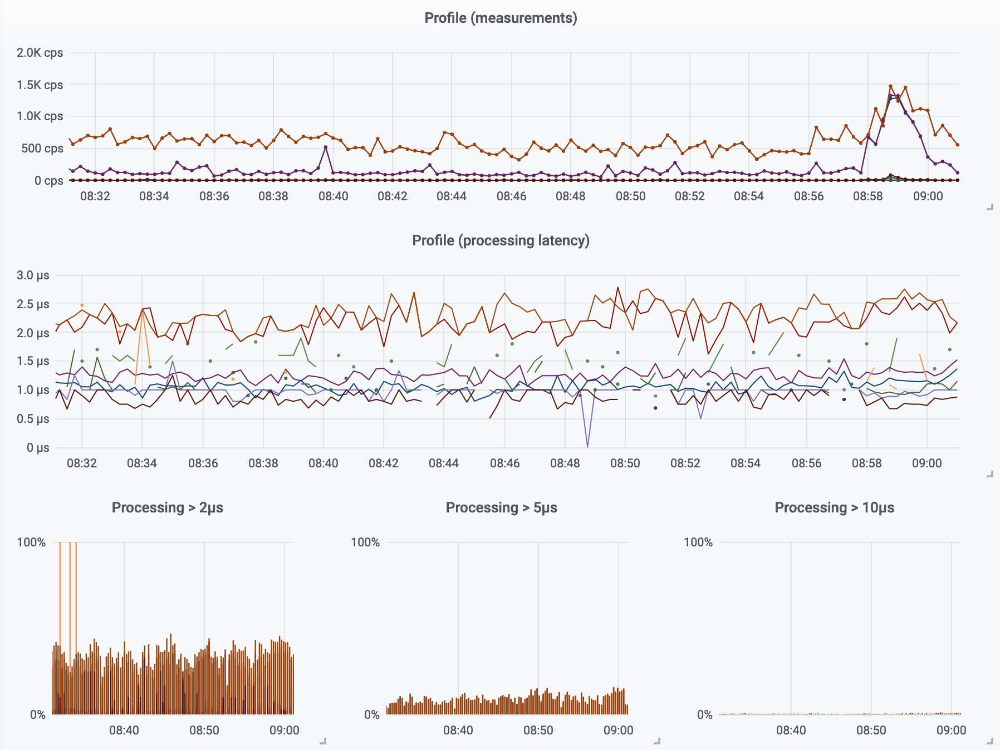
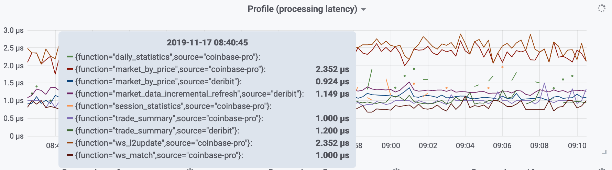

# Roq Trading Solutions

*A C++ HFT Toolkit for Algo Traders*

## What is it?

The API used to communicate between clients (the
implementation of your trading strategy) and other
components developed by Roq, e.g. market gateways.

## Overview

An open sourced API motivated by

* No requirement to sign a NDA
* Anyone should be able to implement solutions against the interface

> Closed source solutions include
> * `roq-coinbase-pro` market gateway
> * `roq-deribit` market gateway
> * `roq-client` library
>   * Low latency communication between trading strategy
>     and market gateways
>   * Simulation framework, including FIFO order matching
> * `roq-influxdb` exporter
>
> Some solutions are free to use, e.g. `roq-client` and `roq-influxdb`.
> Other solutions will require you to enter a license agreement, e.g.
> `roq-coinbase-pro` and `roq-deribit`.

## Build

The API is not very useful by itself.
You will need an implementation of the interface,
such as the `roq-client` library.

> You will not achieve anything by compiling this project.

Instead, head over to
[Roq Samples](https://github.com/roq-trading/roq-api)
and follow the instrutions there to install `roq-client`
and get started with compiling your own projects.

## Benefits

* Ultra low latency (single digit microsecond response time)
* Very high message throughput
* Messages communicated to clients using a broadcast (publish once) design
* Automatic connection and download management
* Message normalization
* Market data (L1, L2, trade summary, session/daily statistics, etc).
* Order management (create, modify, cancel, ack, update, trade)
* Positions and funds (when available)
* Automatically persist all messages to storage device (zero latency impact)
* Integrate well with popular network kernel-bypass solutions (using epoll)
* Suitable for fully autonomous algorithmic trading

## Constraints

* C++17
* Linux (RHEL, CentOS, Debian, Ubuntu)
* Same-host deployment
* Shared memory for communication
* Micro-service design
* Busy polling causing 100% CPU usage
* Use of CPU isolation and thread affinity, disable hyperthreading,
  are all strongly recommended practices
* Enough CPU cores to support your use-case

## Solutions

These are some of our solutions

* `roq-client`
  * Low latency client-server communication
  * Simulation framework, including FIFO order matching
* `roq-coinbase-pro`
  * Market gateway
  * FIX, WebSocket and REST
* `roq-deribit`
  * Market gateway
  * FIX and WebSocket
* `roq-influxdb`
  * InfluxDB exporter
* `roq-ansible`
  * Server provisioning using Ansible
  * Gateway configuration
* `roq-client-template`
  * Ansible Playbook (using `roq-ansible`)
* `roq-vagrant`
  * Deployment using Vagrant and VirtualBox
* `roq-grafana`
  * Grafana dashboards
* `roq-simulator`
  * Market gateway simulator
* `roq-benchmark`
  * Performance testing

## Design

This is not a comprehensive description of the design.
For that we refer to the online documentation (see
link below).

## Performance

> The following examples have been tested on a relatively
> low-powered AMD EPYC 3251 SoC running at 2.5 GHz with
> hyperthreading disabled.
> Linux is Ubuntu Server 18.04 LTS with the `isolcpus`
> kernel parameter set.

The Grafana example dashboard allows you to easily
monitor the performance of the gateways.

This is the heartbeat latency between gateways and
connected clients.

When hovering, you'll be able to see the attributes
of each measurement

> We collect a histogram of the measurements.
> This allows us to visualize e.g. "how many % of the events
> exceed 5 microseconds" (the tail distribution).

> NUMA configuration and thread affinity affects latency.
> This example shows there are two distinct latencies
> depending on the deployment.

The gateways will automatically collect profiling
information.

When hovering, you'll be able to see the the "cost"
of each operation

> The cost of processing JSON updates (`ws_l2update`)
> is about 2x that of processing FIX (`market_data_incremental_refresh`).

## Links

* [Documentation](https://roq-trading.com/docs)
* [Contact us](mailto:info@roq-trading.com)
