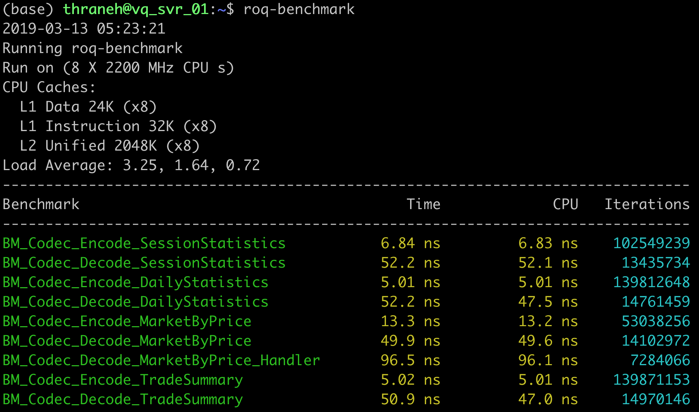
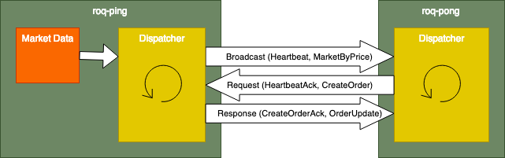
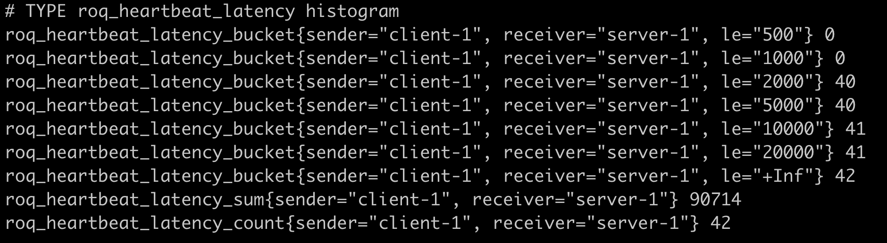
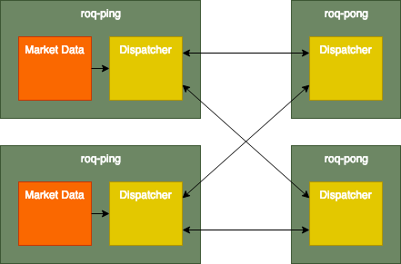
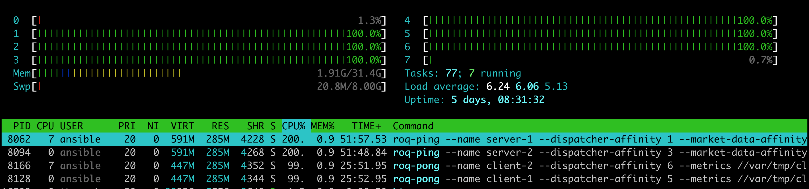
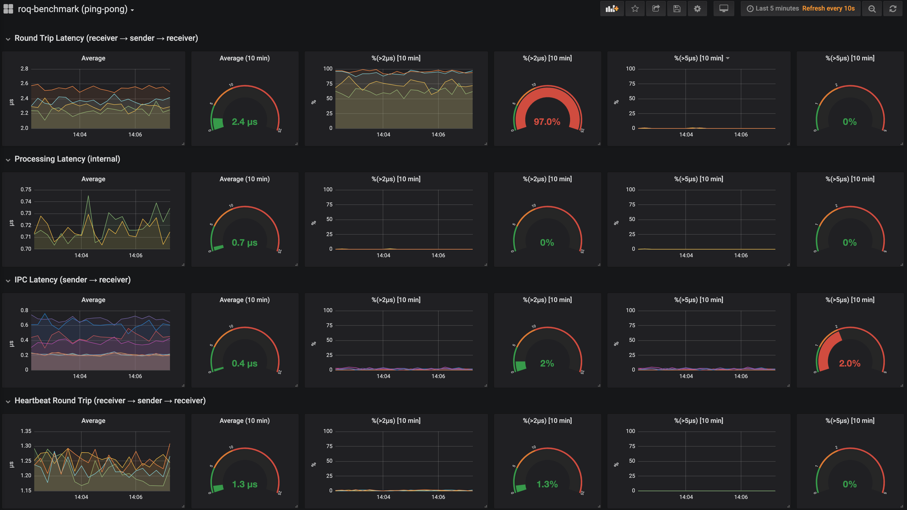

# Roq Trading Solutions

Solutions focused on development, testing and deployment of
algorithmic trading strategies.


## Overview

Solutions

* Market access
* Simulation tools
* Data collection
* Consultancy

Features

* Programming language is C++17.
* Standardized market access API.
* Design is similar to that of
  [microservices](https://en.wikipedia.org/wiki/Microservices).
* User code (the strategy) must implement event handlers.
* Framework will manage complexities, e.g. threading, asynchronous messaging,
  connectivity, download phases, order templates, segregation, policies,
  timeout, positions, etc.
* Ultra low latency with *internal* microservice tick-to-trade response time
  in less than 1 microsecond on top-end hardware.
* Samples on [GitHub](https://github.com/roq-trading/roq-samples).
* Binaries compiled for [Conda](https://docs.conda.io).
* Docker images published to
  [Docker Hub](https://cloud.docker.com/u/roqtrading).
* Ansible playbook on
  [GitHub](https://github.com/roq-trading/roq-ansible).

You can find more information on our
[website](https://roq-trading.com) or by browsing our online
[documentation](https://roq-trading.com/docs).

## What is it?

An API required by the various Roq developed solutions to
communicate.  
By itself, the API offers very little functionality:
Mainly data structures and utilities.

This document is meant to describe high level design.
Please refer to [roq-samples](https://github.com/roq-trading/roq-samples)
for how to use.

## Who is it for?

> **PROFESSIONAL INVESTORS, ONLY!**
> 
> *Automated algorithmic trading is very complex and requires serious
> investment into hardware, software, research, testing, monitoring and
> support.
> In all probability, it will be a loss-making activity if you don't
> invest enough time and money towards simulation and infrastructure*.

Typical requirements

* 100% automation
* Intra-day trading
* Latency sensitive strategies
* High Frequency Trading (HFT)
* Market Taking
* Market Making
* Hedging
* Spread Trading (relative value or multi-leg strategies)
* Execution strategies, e.g. iceberg, VWAP, etc.
* Simulation of market micro-structure (probabilistic execution
  based on order priorities)
* Control the technology stack


## FAQ

<dl>
<dt><strong>Why have you developed this product?</strong></dt>
<dd>
We see an opportunity to offer a complete trading solution for smaller
investement firms who can not afford the integration costs of existing
specialized solutions.
In particular, we believe we have an advantage because our solution offers
all tooling from initial research and testing all the way to deployment.
All the solutions are designed such that a quant/trader can control the
entire technology stack.
API's and the simulation tools are even freely available.
</dd>
<dt><strong>Do I have to sign a NDA to start using the product?</strong></dt>
<dd>
Short answer: No.
Strategy examples can be found on
<a href="https://github.com/roq-trading/roq-samples">GitHub</a>.
Follow the instructions there to get started with your own strategy
implementation.
You can use the simulators together with your own strategy without contacting us.
However, market access is different: You can download gateways, but you will
need to contact us to obtain a valid license file.
</dd>
<dt><strong>I am not a professional investor, should I use the product?</strong></dt>
<dd>
We promote that you use our simulation tools to <i>test</i> your ideas.
Perhaps you can later use the results to partner with a professional investment firm.
</dd>
<dt><strong>What markets do you support?</strong></dt>
<dd>
Currently Chinese markets:
CFFEX/FEMAS, including the multicast market data feed.
Work is ongoing to implement Shengli/REM, a FPGA based solution.
Please contact us to discuss specific requirements.
</dd>
<dt><strong>How do I obtain the market data needed for simulation?</strong></dt>
<dd>
We don't resell market data.
You must obtain historical market data directly from the exchange or
from third-party data vendors.
</dd>
<dt><strong>How is tick-to-trade latency measured?</strong></dt>
<dd>
Remember: The design is that of microservices, i.e. loosely couple
components.
<i>We measure from the time a gateway receives an event from API,
kernel or driver</i>.
The event is then typically processed and cached by the gateway and
then distributed using IPC to connected strategies (microservices).
A strategy can then use IPC to send an order action request back to the
gateway.
<i>We measure to the time a gateway sends a request to API, kernel or
driver</i>.
This latency can be less than 1 microsecond on top-end hardware.
(Remaining latency depends on topics such as colocation, network topology,
tuning of network stack, drivers, hardware solutions, etc).
</dd>
<dt><strong>What are the hardware requirements?</strong></dt>
<dd>
It depends on your use case.
Please contact us to discuss further.
However, the benchmark suite demonstrates semi-realistic requirements.
</dd>
<dt><strong>Why is there no source code for the API?</strong></dt>
<dd>
An earlier version included an open sourced client API implementation.
This unfortunately introduced several support issues which lead us to
the conclusion that all parties are better served with a well defined
client API distributed only in binary form.
However, source code for various use cases is freely available and can
be found on
<a href="https://github.com/roq-trading/roq-samples">GitHub</a>.
</dd>
</dl>


## First steps

The benchmark suite was developed to demonstrate resource requirements
as well as the latency and monitoring capabilities.
(Please refer to [roq-samples](https://github.com/roq-samples) if you
need a guide on how to get started with your own strategy implementation).

* `roq-benchmark` is used to profile key functions
  * Message encoding/decoding
  * String formatting (stream and format operations)
  * Other benchmarking useful for selecting e.g. containers

* `roq-ping` is a service used to simulate the key execution paths of a "server" (for example, a gateway)
  * Broadcast random market data (L2 with a depth of 5)
  * Handle order creation requests
  * Respond with order creation ack 
  * Access to internal metrics

* `roq-pong` is a service used to simulate the key execution paths of a "client" (for example, a strategy)
  * Receive and process market data
  * Optionally request order creation
  * Access to internal metrics

> The services make internal profiling metrics available over HTTP using the
> [Prometheus Exposition Format](https://prometheus.io/docs/instrumenting/exposition_formats/).


### Install Miniconda

> *This section will demonstrate how to install Miniconda*.

A Conda environment allows you to install up-to-date binary packages
on your development box *without* requiring root access.

```bash
# download the miniconda installer
wget -N https://repo.continuum.io/miniconda/Miniconda3-latest-Linux-x86_64.sh

# install miniconda (to your home directory)
bash Miniconda3-latest-Linux-x86_64.sh -b -u -p ~/miniconda3

# configure roq-trading as a default conda channel
cat > ~/miniconda3/.condarc << EOF
channels:
  - defaults
  - https://roq-trading.com/conda/unstable
EOF
```

### Activate Miniconda

> *This section will demonstrate how to activate your Conda environment*.

This is how you activate your Conda environment

```bash
source ~/miniconda3/bin/activate
```

Note! The following sections will assume you have *already* activated your
Conda environment.


### Install the benchmark suite

> *This section will demonstrate how to install the binaries
> using Conda.*

First install the benchmark suite

```bash
conda install -y roq-benchmark
```

### Test (local)

You can test the speed of key functions:

Run the benchmark suite

```bash
roq-benchmark
```

You should now see something like this



And you can simulate a real network of gateways and clients:

This is our generic test case



> The design is meant to be a realistic simulation with
> regular random market data updates being broadcast from
> `roq-ping` to `roq-pong`.
> It is *not* a test of maximum throughput since that's not
> typical for a live trading environment.
> It is much more important to test for a regular mix of
> "sleep" and "wake" patterns.
> Oftentimes you will find that "sleep" is really bad for latency.
> For example, cached memory may be evicted or threads may require
> wake-up by the kernel.

This is how to launch the ping service

```bash
ROQ_v=1 roq-ping \
  --name "server-1" \
  --dispatcher-affinity 1 \
  --market-data-affinity 2 \
  --metrics 1234 \
  --listen ~/ping.sock
```

And you should launch the pong service from another terminal

```bash
ROQ_v=1 roq-pong \
  --name "client-1" \
  --dispatcher-affinity 5 \
  --create-orders 1 \
  --metrics 2345 \
  ~/ping.sock
```

> `ROQ_v=1` sets an environment variable used to specify the
> verbosity of application logging. You may drop this part from the
> command-line (or use `ROQ_v=0`) to only see minimal logging.
>
> Verbose logging can be very costly: `roq-benchmark` will give you
> more details about the "cost" of typical messages being logged.

You can now query for profiling metrics

```bash
wget -q -O - http://localhost:1234/metrics | less
```

or

```bash
wget -q -O - http://localhost:2345/metrics | less
```

You should see something like this




### Test (server)

> *This section will demonstrate how to provision a server using the 
> Ansible playbook*.

This is the test case



Requirements

* Physical access (not a VM)
* At least 8 physical cores
* Linux (CentOS/7, Ubuntu 18.04, or better)
* An `ansible` sudo user with ssh access rights

For best results 

* Add `isolcpus=1-6` to `/proc/cmdline` and reboot the server.
* Disable hyper-threading in the BIOS.
* Tune your system for low latency performance,
  e.g. `tuned-adm profile network-latency`.

The Ansible playbook includes these following steps

* Configure the server for low latency performance
* Install benchmark application configurations, application launch
  scripts and systemd service scripts
* Install Prometheus, Grafana and Nginx (using Docker)

On your development box

```bash
# install git and ansible
conda install -y git ansible-playbook

# clone the playbook
git clone https://github.com/roq-trading/roq-ansible

# change into the new directory
cd roq-ansible

# define your inventory
# note! replace "x.x.x.x" with your server's network address
cat > server << EOF
[SERVER]
server ansible_host="x.x.x.x"
[roq-benchmark]
server
EOF

# run the ansible playbook
ansible-playbook -i server site.yml --ask-become-pass
```

On your server

```bash
sudo systemctl start roq-ping-1
sudo systemctl start roq-ping-2
sudo systemctl start roq-pong-1
sudo systemctl start roq-pong-2
```

You should now see core 1-6 consume 100% CPU (if everything was
installed correctly)



You can tail the logs

```bash
sudo journalctl -f -u roq-p[io]ng-[12]*
```

Navigate to this URL using your favourite browser

> Replace `x.x.x.x` with your server's network address

```
http://x.x.x.x/grafana/
```

Find the pre-installed `roq-benchmark (ping-pong)` dashboard and you
should now be able to monitor latency distributions like this



> These metrics are collected from an Atom C3758 8-core processor.


## Next steps

* [Contact us](mailto:info@roq-trading.com)
* [Roq Trading Solutions (website)](https://roq-trading.com)
* [Online documentation](https://roq-trading.com/docs)
* [Development samples](https://github.com/roq-trading/roq-samples)
* [Ansible playbook](https://github.com/roq-trading/roq-ansible)
* [Grafana dashboards](https://github.com/roq-trading/roq-grafana)
* [Vagrant development environments](https://github.com/roq-trading/roq-vagrant)
